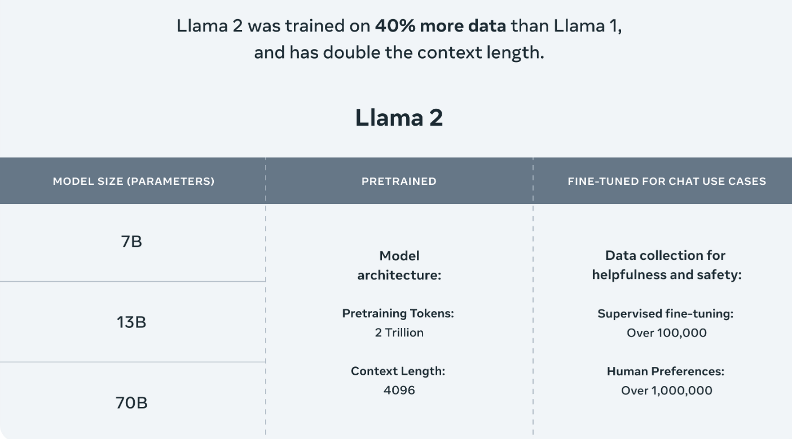

# Fine Tuning and inference of LLama V2 7b on colab 


```
To get access to the models, first fill up the form here with the same mail id used to create huggingface account. 
```

Link : https://ai.meta.com/resources/models-and-libraries/llama-downloads/ 

Huggingface Model card : https://huggingface.co/meta-llama 

Dataset : https://huggingface.co/datasets/timdettmers/openassistant-guanaco 

### **Llama Model size**



